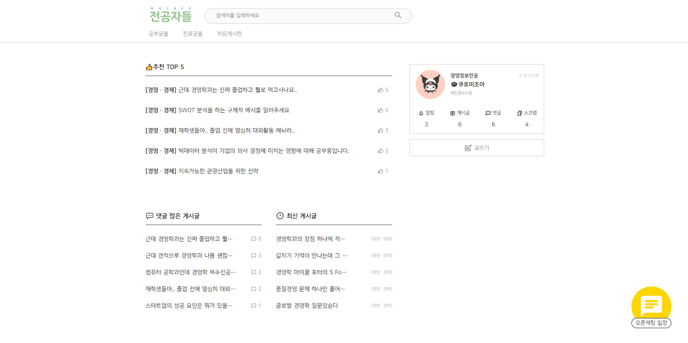
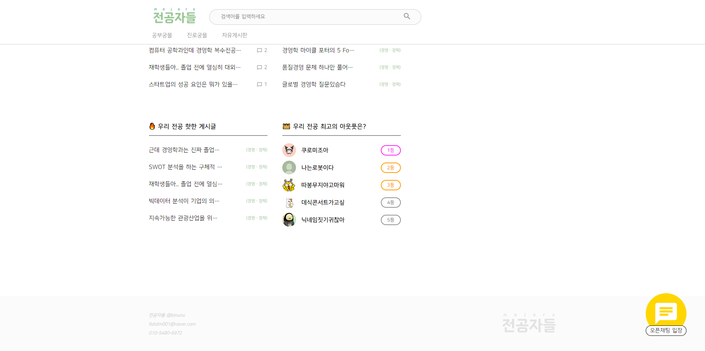
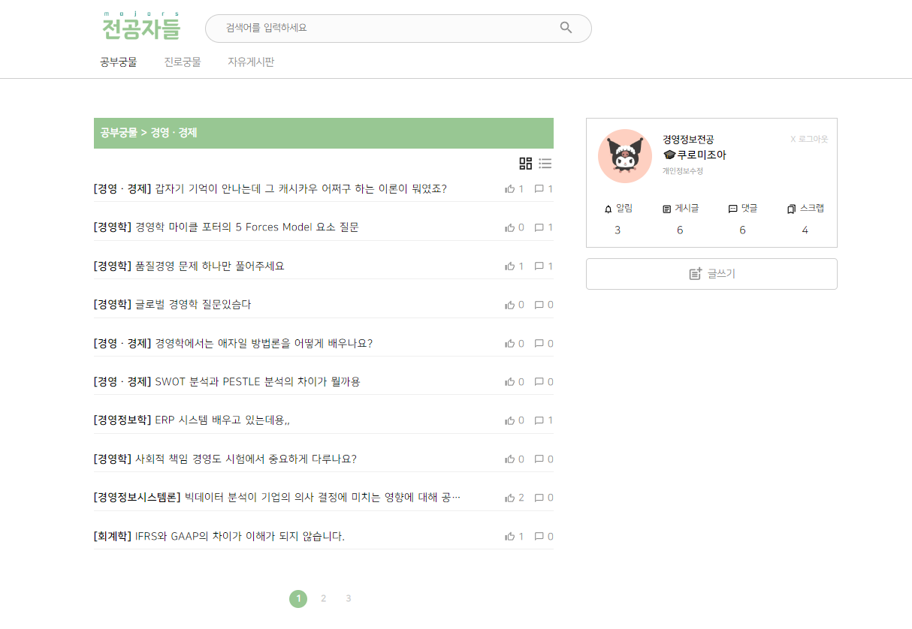
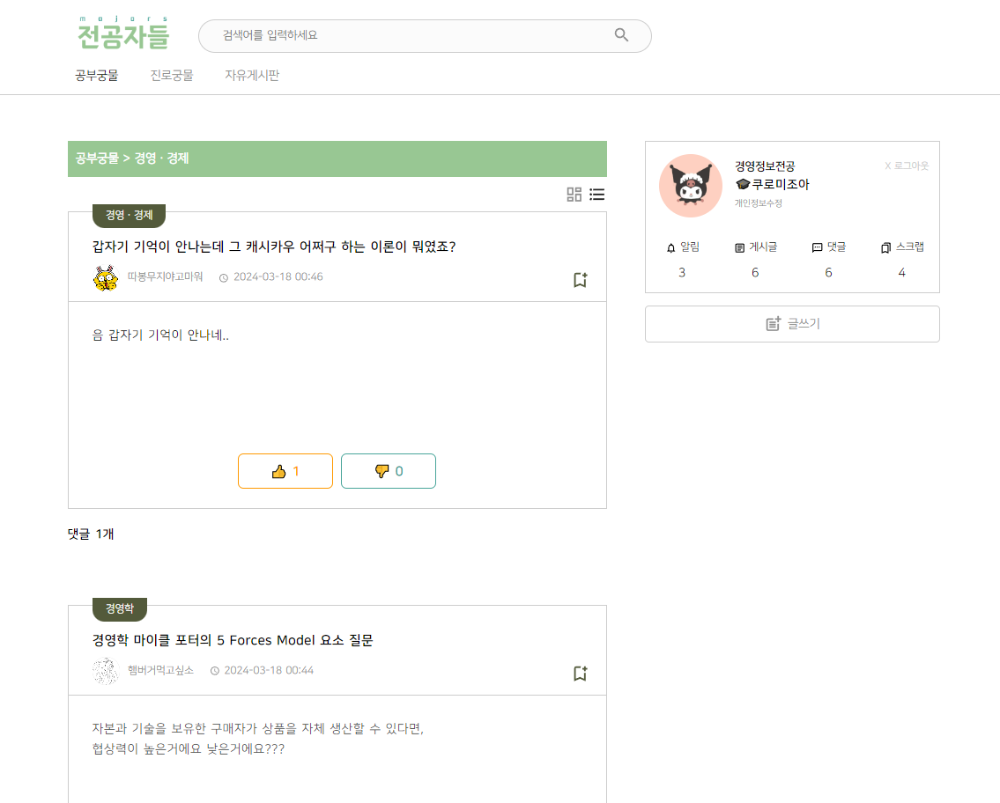
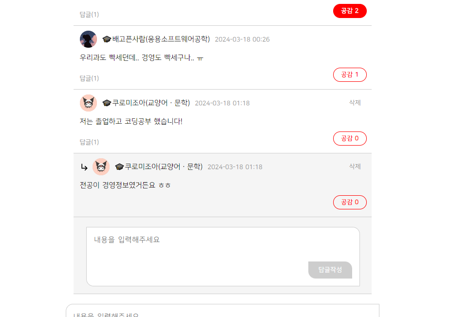
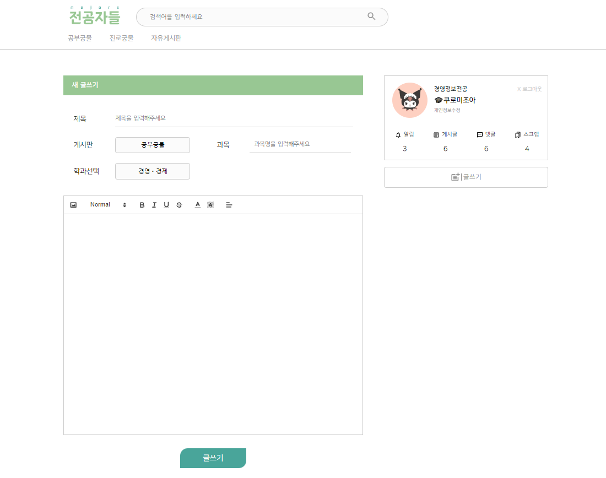
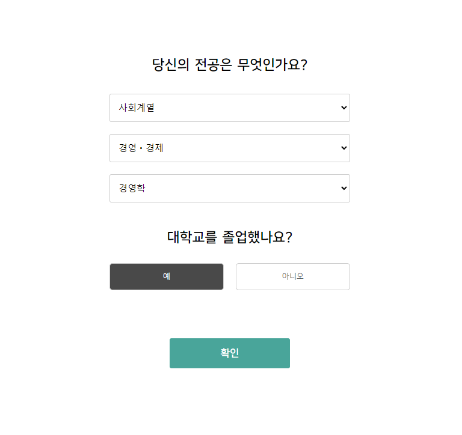
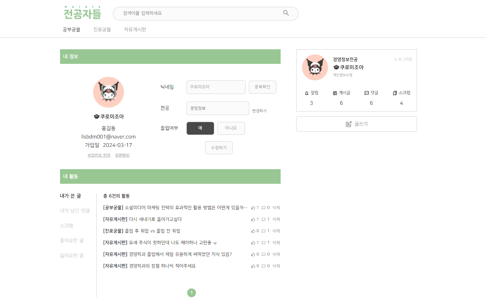

  

 
 
  

> 학교의 구분 없이 내 전공에 대한 질의응답을 주고받는 커뮤니티 플랫폼 (프론트엔드 레포지토리)
> 
> 개발기간 : 2023. 06.20~ 2023.07.27
> 
> 5인 팀프로젝트
>
> [백엔드 레포지토리로 이동](https://github.com/binunu/majors_backend)

 
 

## 📖 Description  

"전공자들"은 공부를 하다가 물어 볼 곳이 없을 때, 우리 학과를 졸업한 선배들의 소식이 궁금할 때

학교의 범위를 넘어서서 나와 같은 전공을 공부하는 전국의 모든 전공자들과의 커뮤니케이션을 통해 

긍정적인 상호작용을 이끌어 내는 학문적이고 건강한 커뮤니티 플랫폼을 만들고자 하였습니다. 

 
 

## 🐤 Demo

  
  

 

  

 

  

 

  

  

## ⭐ Main Feature 
  
**1. 공부 질의응답 / 졸업생들과의 취업 질의응답 / 자유 커뮤니티의 3 가지 게시판**

**2. 각 게시판 내의 학과별 세부 게시판**
 

 
 

## 🔧 Stack
- **framework** : springboot, react

- **language** : html, css, js, java
  
- **db** : mongoDB
  
- **IDE** : sts, vscode
  
- **tool** : git, figma, google excel, notion

  
